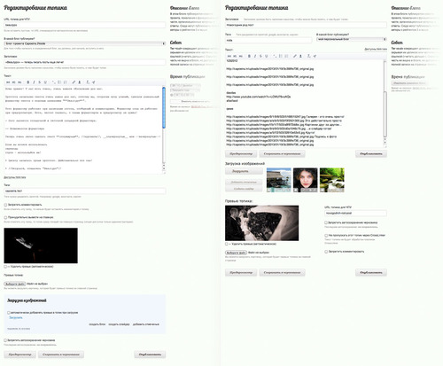
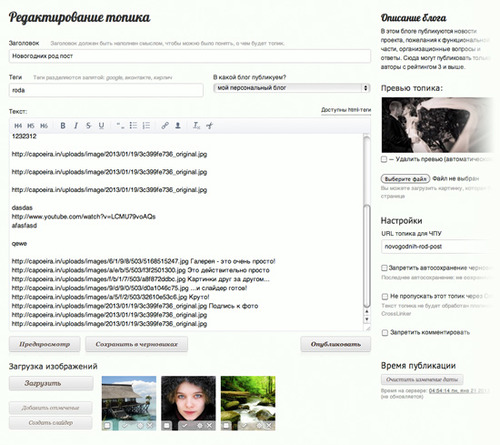

# Улучшаем страницу редактирования статей

Вторую половину воскресного дня я решил потратить на переработку
страницы добавления/редактировния статей:

-   Вынес тэги наверх и объеденил их с выбором блога;
-   Кнопки сохранения и предпросмотра заняли своё логическое место под
    тестовой областью. Теперь не надо проматывать полтора-два экрана в
    их поисках;
-   Все администраторске настройки сгруппированы и вынесены вниз, где не
    мешают никому;
-   Постарался расположить элементы поплотнее, чтобы выиграть место;
-   Доработан дизайн и функционал загрузки изображений. Что надо
    скрываться, скрывается, когда надо показываться — показывается;
-   Заменили шрифт в текстовой области, теперь писать еще удобнее;
-   Сэкономили около 400 пикселей по высоте;

<figure>

</figure>

Однако, теперь я вижу, как сделать ещё удобнее, попутно уменьшив высоту
на 300 пикселей. Т.е. от изначального варианта мы отсекли 700 пикселей,
а это — целый экран на нетбуках.

В основном блоке останутся только необходимые элементы: заголовок,
статья, работа с изображениями, тэги и выбор блога. Блок «Загрузка
изображений» тоже стоит улучшить в плане юзабилити.

Все второстепенные настройки вынесем в боковую колонку и оставим там.
Описание блога стоит ограничить по высоте и разворачивать при наведении.
Настройки вообще можно скрыть под кнопку, чтобы не мозолили глаза. Но
это — планы на дальнее будущее.

<figure>

</figure>

 January 21st, 2013 12:46am  Blog
