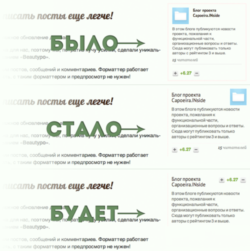

# Блок «О блоге»

Немного переделал блок «О блоге» в боковой колонке. Убрал тяжелую рамку,
увеличил шрифт, облегчил заголовок, сгруппировал элементы.

Тут же придумал, как улучшить далее.

Во-первых, нам совершенно не нужна иконка блога. Она не несет никакой
информации в рамках концепции нашего проекта. Убираем.

Во-вторых, количество читателей блога у нас тоже не несет практического
смысла. Большинство подписывается на блоги только чтобы получать
уведомления на почту о новых статьях. В топку.

На выходе получим что-то вроде этого.

Однако стоит поработать с голосами за блог. В верхнем правом углу они
могут мешать.

 January 23rd, 2013 9:28pm  Blog
